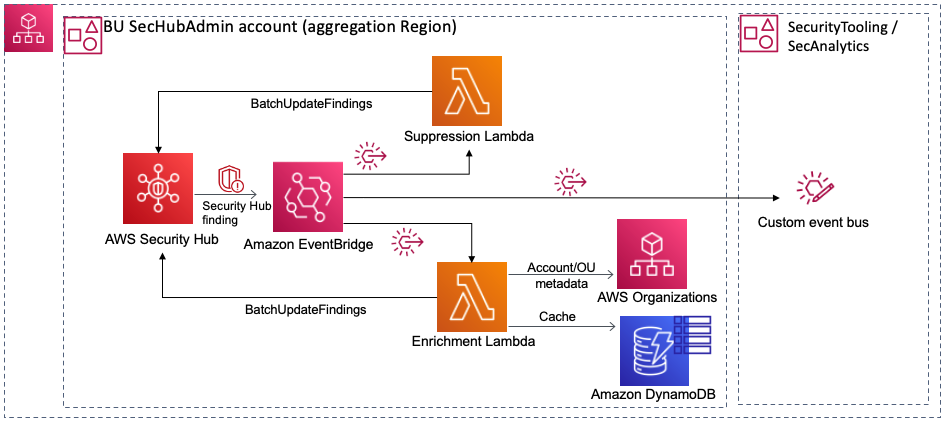

# security-hub-decentralized deployment

## About
This project contains source code and supporting files for a serverless pipeline for for operating security hub in a decentralized deployment model that you can deploy with the SAM CLI. It includes the following files and folders.

- enrichment_function - Code for the application's Lambda functions to enrich security hub findings.
- suppression_function - Code for application's Lambda to suppress findings based Generator Ids and AWS Account
- aws-securityhub-decentralized-deployment.yaml - A template that defines the application's AWS resources.

The application uses several AWS resources, including AWS Lambda function and Amazon EventBridge Rules. These resources are defined in the `aws-securityhub-decentralized-deployment.yaml` file in this project. 

## Solution Architecture
The solution uses the Organizations API to describe the account and the tags details to enrich the finding with the account details in Notes fields as well as in the user defined field so that it can used later filtering and sending customized reports 

## Building and Deploying the application

### Requirements

* AWS CLI - Installed and Configured with a valid profile [Install the AWS CLI](https://docs.aws.amazon.com/cli/latest/userguide/cli-chap-install.html)
* SAM CLI - [Install the SAM CLI](https://docs.aws.amazon.com/serverless-application-model/latest/developerguide/serverless-sam-cli-install.html)
* [Python 3 installed](https://www.python.org/downloads/)
* The Bash shell. For Linux and macOS, this is included by default. In Windows 10, you can install the [Windows Subsystem for Linux](https://docs.microsoft.com/en-us/windows/wsl/install-win10) to get a Windows-integrated version of Ubuntu and Bash.

### Setup
Download or clone this repository.

    $ git clone git@github.com:aws-samples/aws-security-hub-decentralized-deployment.git
    $ cd aws-security-hub-decentralized-deployment

> Note: for all the AWS CLI commands used below, `us-east-1` is used as the default region.

Update the AWS CLI profile to be used in the `profile.txt` file.
    Note: even for `default` profile  ,Create a file with text `default` in the `profile.txt` file

To create a new bucket for deployment artifacts, run `create-bucket.sh` by specifying the region as arguement as shown below.

    $ ./create-bucket.sh us-east-1
    make_bucket: lambda-artifacts-a5e491dbb5b22e0d

### Deploy
* Deploy the `management-account-contact-readonly-role-template.yml` in the Org. Manamagement account and copy the Role ARN from the CloudFormation Stack output section
* Deploy the stack  with required parameters (`SecurityToolingAccountEventBus`, `OrgManagementAccountContactRole` )
  * `SecurityToolingAccountEventBus` is the ARN of the EventBus to post the Security Hub findings from the BU/OU level Security Hub administrator account
  * `OrgManagementAccountContactRole` is the arn of the IAM role created in the ORg.management account ( created in the first step) which has the read-only permission policy for Account management `GetAlternateContacts` API.

To deploy the solution, run `deploy.sh` by specifying the region as arguement as shown below.

    $ ./deploy.sh us-east-1
    BUILD SUCCESSFUL in 1s
    Successfully packaged artifacts and wrote output template to file out.yml.
    Waiting for changeset to be created..
    Successfully created/updated stack - aws-security-hub-decentralized-deployment

This script uses AWS CloudFormation to deploy the Lambda functions and an IAM role. If the AWS CloudFormation stack that contains the resources already exists, the script updates it with any changes to the template or function code.

### Cleanup

To delete the sample application and all the associated resources including s3 buckets and log files run cleanup.sh and specify the region

   $ ./cleanup.sh us-east-1

## License

This solution is licensed under the MIT-0 License. See the LICENSE file.
